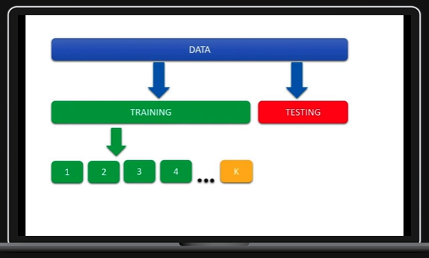
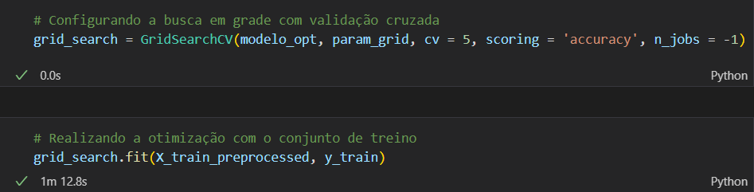
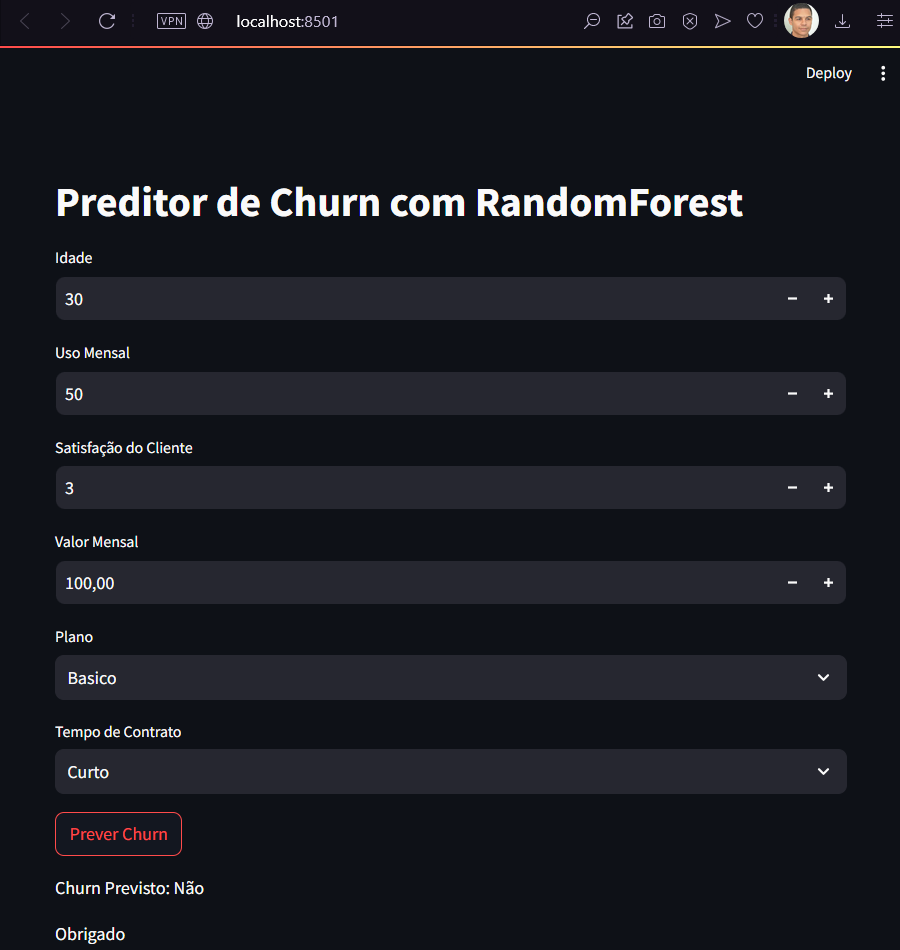

# ML_Churn_RandomForest
Este  projeto  visa  desenvolver  um  modelo  preditivo  robusto  para  prever  o  churn  de clientes  utilizando  o  algoritmo  RandomForest

<details>
  <summary>Visão Geral</summary>

**Concepção do Problema**: Identificação e definição clara do problema de churn de clientes. Análise de como o churn afeta a empresa e quais padrões podem ser observados nos dados históricos.

**Coleta de Dados**: Reunir dados históricos relevantes dos clientes. Usaremos dados fictícios com variáveis que representam informações reais para esse tipo de problema.

**Pré-processamento e Limpeza de Dados**: Limpar e formatar os dados para análise. Isso inclui tratar valores ausentes, remover duplicatas e normalizar os dados.

**Exploração de Dados**: Análise exploratória para entender as tendências, padrões e relações nos dados. Isso ajudará a formular hipóteses para o modelo.

**Modelagem com RandomForest**: Utilização do algoritmo RandomForest para construir um modelo preditivo. O RandomForest foi escolhido pela sua eficácia em lidar com grandes conjuntos de dados e sua habilidade em modelar interações complexas entre variáveis.

**Avaliação do Modelo**: Testar o modelo com um conjunto de dados separado para avaliar sua precisão e eficácia. Ajustes e otimizações serão feitos com base nos resultados.

**Implementação (Deploy)**: Desenvolver uma estratégia para implementar o modelo que então será usado com novos dados para entregar as previsões.

**Objetivo Final**: Reduzir a taxa de churn de clientes através de previsões precisas, permitindo que a empresa tome ações proativas.

</details>

<details>
  <summary>Publico Alvo</summary>

Este projeto é ideal para empresas que buscam entender melhor o comportamento de churn dos seus clientes e querem implementar soluções baseadas em dados para  melhorar à retenção de clientes.

</details>

## Antes de tudo... o que é o Churn?
**Churn** é quando um cliente decide parar de usar um serviço, cancelar uma assinatura ou deixar de comprar de uma empresa. Em Machine Learning, prever churn significa tentar descobrir quem vai sair antes que isso aconteça.

Os modelos de churn olham para coisas como o que o cliente compra, quanto usa o serviço, como ele interage com o suporte ao cliente e seu feedback para ver quem está pensando em ir embora. Esses modelos funcionam como uma espécie de detetive, classificando os clientes em duas categorias: "vai sair" ou "vai ficar".

Para treinar esses modelos, usamos dados antigos onde sabemos quem realmente saiu e quem ficou, ajudando o modelo a aprender os sinais que indicam que um cliente está prestes a sair. Isso permite que a empresa aja antes que o cliente vá embora.

<details>
  <summary>Algoritmo do RandomForest</summary>

O algoritmo RandomForest, no contexto de Machine Leaming, é um método de ensemble (conjunto) que opera construindo uma série de árvores de decisão durante o treinamento e produzindo como previsão uma média ou combinação das previsões de cada árvore.

RandomForest pertence a uma classe mais ampla de algoritmos de ensemble chamada bagging.

1. Amostragem Bootstrap

O algoritmo começa com a criação de múltiplos conjuntos de dados de treinamento através de amostragem bootstrap. Isso significa que, para cada nova árvore, o algoritmo seleciona aleatoriamente amostras do conjunto de dados original com substituição (o que significa que a mesma amostra pode aparecer mais de uma vez).

2. Construção de Árvores de Decisão

Para cada conjunto de dados bootstrap, uma árvore de decisão é construída. Durante a construção da árvore, apenas um subconjunto aleatório das características é considerado para a divisão de cada nó. Isso aumenta a diversidade entre as árvores e ajuda a evitar overfítting, pois cada árvore tem uma perspectiva diferente dos dados.

3. Decisões de Divisão
   
Ao contrário de uma única árvore de decisão, onde todas as características são consideradas para fazer uma divisão, o RandomForest seleciona  aleatoriamente um número limitado de características em cada nó para encontrar a melhor divisão possível entre elas.

4. Crescimento das Árvores

As árvores são crescidas ao máximo possível sem poda, o que significa que continuam a se expandir até que cada folha seja pura (contenha amostras de apenas uma classe) ou contenha menos do que um mínimo número de amostras definido.

5. Predição

Para fazer previsões, o RandomForest coleta as previsões de todas as árvores individuais. No caso da classificação, a classe mais votada (moda) por todas as árvores é tomada como a previsão final. Para regressão, a média das previsões é usada.

6. Reducão de Variância
  
Uma vantagem fundamental do RandomForest é a redução de variância em comparação com uma única árvore de decisão. Como o algoritmo usa a média ou a moda das previsões de muitas árvores construídas em diferentes subconjuntos dos dados, o resultado é menos sensível a variações específicas e ruído nos dados de treinamento.

7. Importância das Características
O Randomrorest pode fornecer estimativas da importância de cada característica para a predição. Isso é feito analisando quanto a qualidade da divisão (geralmente medida pela redução da impureza) diminui quando a característica não está disponível.

RandomForest é amplamente utilizado por sua simplicidade e poder de generalização, sendo eficaz para uma ampla gama de tarefas de modelagem preditiva e geralmente funcionando bem sem a necessidade de muita otimização de hiperparâmetros.


</details>

<details>
  <summary>Validação Cruzada</summary>

A validação cruzada é uma técnica de avaliação de modelos em Machine Learning que é essencial para assegurar a robustez e a generalização do modelo.

Destacamos a seguir alguns motivos pelos quais a validação cruzada é importante:

- A validação cruzada fornece uma estimativa mais imparcial do desempenho do modelo em dados não vistos ao usar diferentes subconjuntos do conjunto de dados para treinar e testar o modelo múltiplas vezes.

- Ao avaliar o modelo em várias divisões dos dados, podemos detectar se um modelo está simplesmente memorizando os dados de treinamento (overfitting) em vez de aprender padrões generalizáveis.

- Utilização eficaz dos dados pois, especialmente em conjuntos de dados menores, a validação cruzada permite o uso de todos os dados disponíveis para treinamento e teste, maximizando assim a quantidade de dados utilizada.

- É uma ferramenta útil para comparar a performance de modelos treinados com diferentes hiperparâmetros, permitindo a escolha do melhor conjunto de hiperparâmetros para o modelo final.

- A validação cruzada ajuda a comparar diferentes modelos e escolher o melhor, fornecendo uma medida de desempenho que é menos dependente da divisão particular de treinamento/teste dos dados.

- Ela verifica a robustez do modelo em diferentes ubconjuntos de dados, o que é importante para garantir que o modelo será eficaz em diferentes amostras de dados reais.

- A validação cruzada não só fornece uma estimativa de desempenho, mas também permite calcular a variância do desempenho do modelo, dando uma ideia de quão sensível o modelo é a diferentes dados.

O método mais comum de validação cruzada é o kfold, onde o conjunto de dados é dividido aleatoriamente em 'k subconjuntos (ou "folds'). O modelo é treinado em 'k-1' folds e testado no fold restante, e esse processo é repetido 'k' vezes, com cada fold servindo como o conjunto de teste exatamente uma vez.

O desempenho do modelo é dado pela média dos desempenhos em cada fold. Outros métodos incluem a validação cruzada estratificada, que é semelhante ao k-fold, mas preserva a proporção de classes em cada fold, sendo especialmente útil para conjuntos de dados desbalanceados.


</details>

<details>
  <summary>Otimização de Hiperparâmetros</summary>

Para a validação, foram selecionados quatro hiperparâmetros:

- n_estimators: Número de árvores no ensemble
- max_depth: Profundidade máxima de cada árvore
- min_samples_split: Número mínimo de amostras necessário para dividir um nó
- min_samples_leaf: Número mínimo de amostras exigido em um nó folha

Os valores dos hiperparâmetros foram escolhidos de maneira aleatória com o objetivo de identificar os melhores parâmetros para otimizar o desempenho do modelo.

Para validar todas as combinações possíveis, utilizou-se o parâmetro GridSearchCV, que compara todas as possibilidades e informa os melhores parâmetros.



</details>

<details>
  <summary>Deploy do modelo</summary>

Para executar o modelo de Machine Learning, utilize o `streamlit`. O comando a ser executado no terminal é:

```
streamlit run deploy.py
```
para validar insira os valores desejados:




</details>